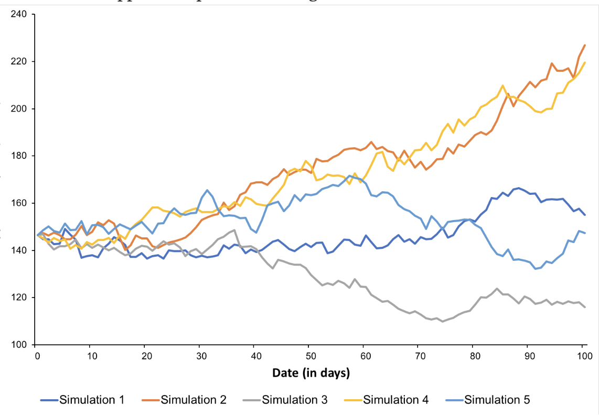
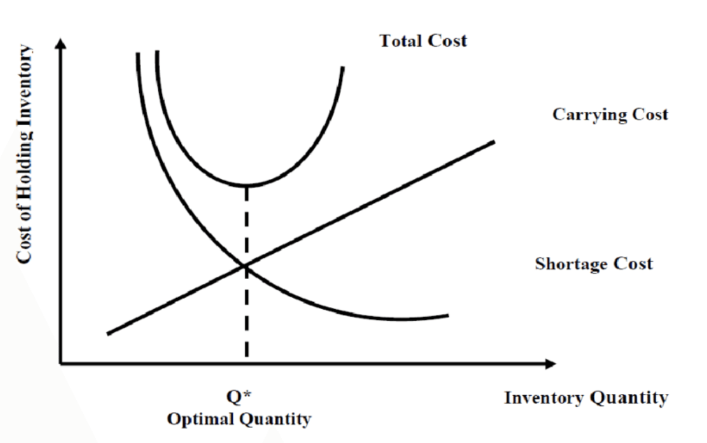

# supply-chain-optimization
Supply chain optimization algorithms using python.


# 1 References

- [Economic Order Quantity](https://en.wikipedia.org/wiki/Economic_order_quantity)

# 2 Architecture

## 2.1 Overview

In a modular architecture, a software system is designed and implemented as a collection of
individual components or modules that can function independently. Each module is self-contained,
and has a well-defined interface that allows it to interact with other modules. These interfaces
specify the inputs and outputs of each module, as well as any restrictions or requirements for
using the module.

The advantage of a modular architecture is that it allows developers to create complex systems
by combining small, well-defined components. This approach promotes code reuse, simplifies
maintenance and debugging, and makes it easier to add new functionality to the system.

|File|Description|
|---|---|
|[v1/simulator.py](./v1/simulator.py)|Monte-Carlo simulator.|
|[v1/center.py](./v1/center.py)|Cost center class.|
|[v1/cost.py](./v1/cost.py)|A data structure for storing variable and fixed costs.|
|[v1/product.py](./v1/product.py)|A data structure for storing products and variable costs.|

## 2.2 Data Model

#### [Cost](./v1/cost.py)

|Attribute|Type|Description|
|---|---|---|
|name|String|Cost name|
|value|Decimal|Cost value|

#### [PurchasedProduct](./v1/product.py)

|Attribute|Type|Description|
|---|---|---|
|name|String|Product name|
|price|Decimal|Market price|
|demand|Decimal|Annual demand|
|inventory|Decimal|Annual demand|
|storage_costs|Array<Cost>|Holding cost per unit|
|purchase_costs|Array<Cost>|Purchase costs per unit|

#### [ProducedProduct](./v1/product.py)

|Attribute|Type|Description|
|---|---|---|
|name|String|Product name|
|price|Decimal|Market price|
|demand|Decimal|Annual demand|
|inventory|Decimal|Annual demand|
|storage_costs|Array<Cost>|Holding cost per unit|
|production_costs|Array<Cost>|Production costs per unit|

#### [Center](./v1/center.py)

|Attribute|Type|Description|
|---|---|---|
|Name|String|Cost center name identification|
|address|String|Cost center address|
|costs|Array<Cost>|Cost center fixed costs|

# 3 Instructions

## 3.1 Monte-Carlo Simulation



Monte Carlo simulation is a computational technique used in probability theory and statistics to model
and analyze complex systems or processes that involve uncertainty. It involves using random sampling and
statistical analysis to generate a range of possible outcomes for a given system or process.

```python3
from v1.simulator import Simulator

with Simulator(times=10, title='Example') as simulator:

    @simulator.simulate()
    def main() -> Decimal:
        """
        Sample simulator case.
        """
        return simulator.normal(mean=3, std=1, upper=10, lower=1)
```
```bash
--------------------------------------------------
Example Sumary:
- Simulated: 10 times
- Average: 3.149073238815085229447277015
- Maximum: 5.0041348650403794096064302721060812473297119140625
- Minimum: 1.884182643119448385959913139231503009796142578125
--------------------------------------------------
```

## 3.2 Fitting empirical data to a theoretical distribution

Fitting an array of empirical data points to a theoritcal distribution using NumPy and SciPy:

```python3
import numpy as np
import scipy.stats as stats

data: np.array = np.array([10, 20, 30, 20, 10, 20, 30, 10, 20, 10, 20, 10, 20, 10])

maximum: int = max(data)
minimum: int = min(data)

distributions_by_pvalue: dict = {}
for name in (
    'beta',
    'cauchy',
    'chi2',
    'expon',
    'gamma',
    'laplace',
    'lognorm',
    'norm',
    'pareto',
    'rayleigh',
    't',
    'uniform',
    'weibull_min',
    'weibull_max',
    'pareto',
    'exponweib',
    'genextreme',
):
    distribution: 'scipy.stats._continuous_distns' = getattr(stats, name)
    params: tuple = distribution.fit(data)
    kstest: 'KstestResult' = stats.kstest(data, name, params)
    distributions_by_pvalue[kstest.pvalue] = {
        'distribution': distribution,
        'params': params,
    }

best_p_value: float = max(distributions_by_pvalue)
print('Best Distribution:')
print('Distribution:', distributions_by_pvalue[best_p_value]['distribution'])
print('Params:', distributions_by_pvalue[best_p_value]['params'])
```
```bash
Best Distribution:
- Distribution: <scipy.stats._continuous_distns.cauchy_gen object at 0x1322914c0>
- Params: (18.46152767675262, 4.550807537639908)
```

## 3.3 Fixed Cost Forecasting

Cost forecasting in supply chain is the process of estimating the future costs associated with
a company's supply chain activities. This involves analyzing historical data, current trends,
and other relevant information to predict how supply chain costs may change over time.

```python3
from v1.simulator import Simulator
from v1.center import Center
from v1.cost import Cost

with Simulator(title='Total Fixed Cost', times=100) as simulator:

    @simulator.simulate()
    def main() -> Decimal:

        center: Center = Center()
        center.name = 'My Center I'
        center.address = '450 Hawk St.'
        print('Center identifier:', center)

        center.costs.add(Cost('Quality Control Costs', simulator.normal(mean=100, std=20, upper=3000, lower=50)))
        center.costs.add(Cost('Labor Costs', simulator.normal(mean=500, std=100, upper=1000, lower=0)))
        center.costs.add(Cost('Energy Costs', simulator.normal(mean=150, std=180, upper=1000, lower=100)))
        center.costs.add(Cost('Equipment Costs', simulator.normal(mean=200, std=40, upper=320, lower=160)))
        center.costs.add(Cost('Overhead Costs', simulator.normal(mean=30, std=20, upper=300, lower=0)))
        center.costs.add(Cost('Warehouse Rent', simulator.normal(mean=300, std=50, upper=400, lower=200)))
        center.costs.add(Cost('Inventory Management Software', simulator.normal(mean=10, std=5, upper=80, lower=0)))

        return center.total_fixed_cost
```
```bash
--------------------------------------------------
Total Fixed Cost Summary:
- Simulated: 100 times
- Average: 1408.849098985442841192039508
- Maximum: 1806.456092848386123961290651
- Minimum: 1076.932611251075061709059355
--------------------------------------------------
```

## 3.4 Variable Cost Forecasting

A variable cost is a cost that changes in proportion to the level of output or production.
In other words, as the level of production increases, variable costs also increase, and as
the level of production decreases, variable costs also decrease.

In a supply chain context, examples of variable costs include the cost of raw materials,
labor, and shipping or transportation costs. These costs are directly related to the
production and delivery of goods or services and vary depending on the level of output
or production.

```python3
from v1.simulator import Simulator
from v1.product import Product, ProducedProduct
from v1.cost import Cost

with Simulator(title='Product Variable Cost', times=100) as simulator:

    @simulator.simulate()
    def main() -> Decimal:

        product: Product = ProducedProduct(name='Product I', inventory=100)
        product.production_costs.add(Cost('Energy Costs', simulator.normal(mean=2, std=1, upper=5, lower=0)))
        product.production_costs.add(Cost('Labor Costs', simulator.normal(mean=7, std=2, upper=10, lower=5)))

        return product.total_variable_cost
```
```bash
--------------------------------------------------
Optimum Inventory Size Summary:
- Simulated: 100 times
- Average: 9.384934045397640103303160686
- Maximum: 13.39878319216576141315044879
- Minimum: 5.753336277825196631852122664
--------------------------------------------------
```

## 3.5 Storage Cost Forecasting

There are several costs associated with maintaining stock in the inventory in supply chain management.

```python3
from v1.simulator import Simulator
from v1.product import Product, PurchasedProduct
from v1.cost import Cost

with Simulator(title='Product Storage Cost', times=100) as simulator:

    @simulator.simulate()
    def main() -> Decimal:

        product: Product = PurchasedProduct(name='Product II', inventory=100)

        product.storage_costs.add(Cost('Warehousing', simulator.normal(mean=0.1, std=0.1, upper=0.5, lower=0)))
        product.storage_costs.add(Cost('Utilities', simulator.normal(mean=0.1, std=0.1, upper=0.5, lower=0)))
        product.storage_costs.add(Cost('Insurance', simulator.normal(mean=0.1, std=0.1, upper=0.5, lower=0)))
        product.storage_costs.add(Cost('Taxes', simulator.normal(mean=0.1, std=0.1, upper=0.5, lower=0)))
        product.storage_costs.add(Cost('Freight', simulator.normal(mean=0.1, std=0.1, upper=0.5, lower=0)))
        product.storage_costs.add(Cost('Placement', simulator.normal(mean=0.1, std=0.1, upper=0.5, lower=0)))
        product.storage_costs.add(Cost('Ordering', simulator.normal(mean=0.1, std=0.1, upper=0.5, lower=0)))
        product.storage_costs.add(Cost('Obsolescence', simulator.normal(mean=0.1, std=0.1, upper=0.5, lower=0)))

        return product.total_storage_cost
```
```bash
--------------------------------------------------
Product Storage Cost Summary:
- Simulated: 100 times
- Average: 1.009046847258865544985639851
- Maximum: 1.470608471608333550628699981
- Minimum: 0.4727466627521519915156034130
--------------------------------------------------
```

## 3.6 Optimum Inventory Level



This app calculates the optimum inventory level using the Economic Order Quantity (EOQ) formula,
which balances the holding cost of inventory against the ordering cost and the stockout cost.
The formula assumes that demand for the product is constant and that lead time for replenishing
inventory is known.

```python3
from v1.simulator import Simulator
from v1.product import Product, PurchasedProduct
from v1.cost import Cost

with Simulator(title='Product Optimum Inventory Level', times=100) as simulator:

    @simulator.simulate()
    def main() -> Decimal:

        product: Product = ProducedProduct(
            name='Product III',
            invetory=100,
            demand=simulator.normal(mean=1000, std=1000, upper=3000, lower=0),
        )   

        product.production_costs.add(Cost('Energy Costs', simulator.normal(mean=2, std=1, upper=5, lower=0)))
        product.production_costs.add(Cost('Labor Costs', simulator.normal(mean=7, std=2, upper=10, lower=5)))

        product.storage_costs.add(Cost('Warehousing', simulator.normal(mean=0.1, std=0.1, upper=0.5, lower=0)))
        product.storage_costs.add(Cost('Utilities', simulator.normal(mean=0.1, std=0.1, upper=0.5, lower=0)))
        product.storage_costs.add(Cost('Insurance', simulator.normal(mean=0.1, std=0.1, upper=0.5, lower=0)))
        product.storage_costs.add(Cost('Taxes', simulator.normal(mean=0.1, std=0.1, upper=0.5, lower=0)))
        product.storage_costs.add(Cost('Freight', simulator.normal(mean=0.1, std=0.1, upper=0.5, lower=0)))
        product.storage_costs.add(Cost('Placement', simulator.normal(mean=0.1, std=0.1, upper=0.5, lower=0)))
        product.storage_costs.add(Cost('Ordering', simulator.normal(mean=0.1, std=0.1, upper=0.5, lower=0)))
        product.storage_costs.add(Cost('Obsolescence', simulator.normal(mean=0.1, std=0.1, upper=0.5, lower=0)))
        product.storage_costs.add(Cost('Refrigeration', simulator.normal(mean=0.1, std=0.1, upper=0.5, lower=0)))

        return product.optimum_inventory_level
```
```bash
--------------------------------------------------
Product Optimum Inventory Level Summary:
- Simulated: 100 times
- Average: 133.2271375988943578505541154
- Maximum: 320.56641376094574980015750043094158172607421875
- Minimum: 22.1323400761799149449871038086712360382080078125
--------------------------------------------------
```
